# iPhone_Forensics

## Overview

This project involved using the Autopsy tool (https://www.autopsy.com/) to perform forensics on an image captured from an Apple iPhone. The actual case report is provided as a Word file in the GitHub repo as [Case Report National Gallery DC](iPhone_Forensics_Report.docx). The significant details are included here in this README file. We performed the role of investigator as 'Digitech, Inc'. The case involved a conspiracy to steal valuable collectable stamps from the National Gallery in Washington, DC. We were given a forensic image of an iPhone device, and gathered evidence to support the criminal investigation.

## Executive Summary

On January 21, 2016, Digitech Inc. was called in to assist the National Gallery, Washington D.C. (NGDC) case involving the conspiracy associated with the theft of valuable stamps and defacing of museums are at the NGDC.

+	Tracy is a suspect in the aforementioned conspiracy.
+	As part of the investigation, Tracy’s iPhone was taken into custody.
+	Digitech, Inc. was tasked with investigating evidence relevant to the aforementioned conspiracy.

As described fully in the report, Digitech, Inc. made the following findings.

Based on the evidence shown below, it appears that Tracy and her brother Pat conspired with an unknown 3rd party with email address “King kthings throne1966@hotmail.com” to steal stamps from the National Gallery.

## Equipment and Tools

Digitech used the Autopsy open-source forensics tool on a Kali Linux host to analyze an image of Tracy’s iphone. Other websites and tools were also used (e.g. maps.google.com, etc.).

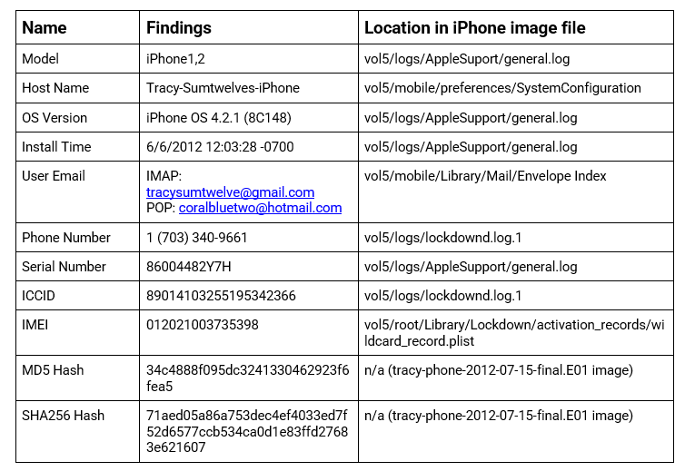

## Evidence to Establish Personas

This section establishes aliases, phone numbers, emails addresses associated with each person, and relationships between each individual.

| Person  | Description | Data |
| :--- | :--- | :--- |
| **Tracy** | | |
| | Phone Number 	| (703) 340-9961 |
| | Personal Email |	tracysumtwelve@gmail.com |
| | Work Email | 		tracy.sumtwelve@nationalgallerydc.org |
| | Relationship | Accused |
| **Pat** | | |
| |	Phone Number | 	(571) 308-3236 |
| | Email |			perrypatsum@yahoo.com |
| |       | patsumtwelve@gmail.com |
| | Relationship |		Tracy’s brother |
| **Terry** | | |
| | Phone Number | 	(703) 829-6071 |
| | Email |			unknown |
| | Relationship |		Tracy & Joe’s daughter |
| **Joe** | | |
| | Phone Number | 	unknown |
| | Email |			unknown |
| | Relationship |		Tracy’s ex-husband |
| **Carry** | | |
| | Phone Number | 	(202) 725-2124 |
| | Email |			unknown |
| | Relationship |		Tracy’s accomplice and friend |

## Evidence relating to theft of valuable stamps

This sub-section provides details regarding the evidence found as it relates to the theft of valuable stamps.

Emails and SMS messages were exchanged between Tracy, Pat, Carry, and an unnamed co-conspirator with email address “King kthings throne1966@hotmail.com” (referenced in Appendix A).

One email from “King kthings” contained an attachment with a list of items needed for the theft.

Figure 1. Email attachment 'needs.jpg' from "King kthings"

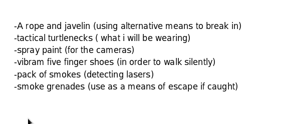

There was also an MP3 audio file attachment  (Crazydave1.mp3) with covert instructions on how to install a VirtualBox VM on a host computer, which was to be used for this crime.

There was an SMS message notifying Tracy that she had received a $1000 Target Giftcard, with instructions to visit a misleadingly named website (```www.target.com```**.trdt.biz**) with instructions to entre a numeric code followed by “where to ship it”. The website ‘trdt.biz’ domain is no longer registered by anyone, and it uses ‘www.target.com’ as a subdomain to hide the fact that it’s really a part of ‘trdt.biz’, and is not affiliated with the Target corporation.

There were 3 .pdf email attachments which were Memoranda of Insurance for various valuable stamps and photos of those stamps in the camera storage location (shown below).

In addition, there were photo images of each of the stamps listed in the insurance documents on the phone.

Figure 2 - Stamp_insurance1.pdf email attachment

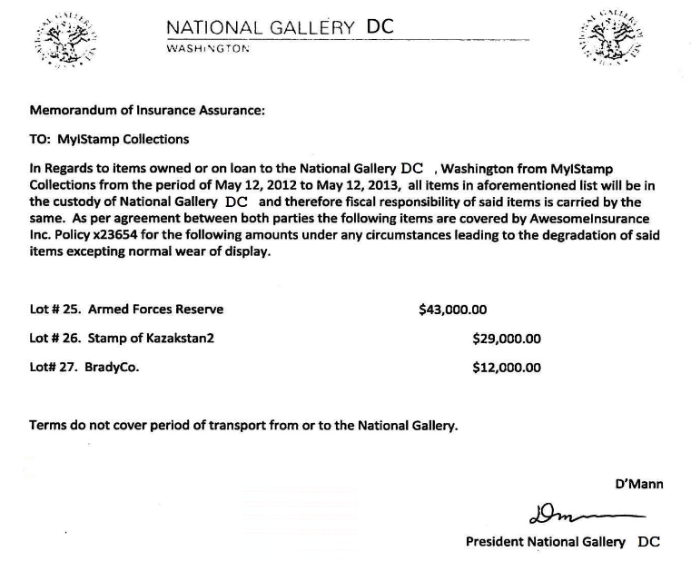

+ /vol5/mobile/Media/DCIM/100APPLE/IMG_0056.JPG
+ /vol5/mobile/Media/DCIM/100APPLE/IMG_0051.JPG
+ /vol5/mobile/Media/DCIM/100APPLE/IMG_0057.JPG

Figure 3 - The three stamps mentioned in Figure 2 above

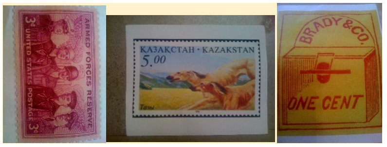

Figure 4 - Stamp_insurance2.pdf email attachment

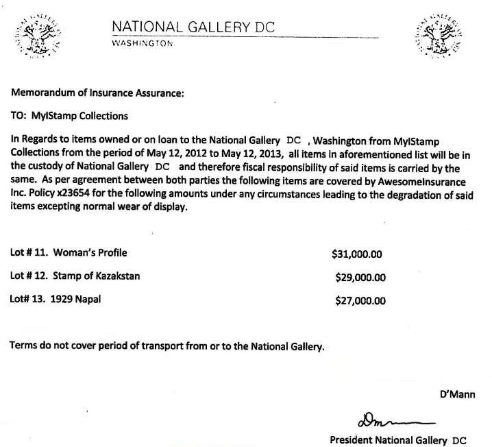

+ /vol5/mobile/Media/DCIM/100APPLE/IMG_0067.JPG
+ /vol5/mobile/Media/DCIM/100APPLE/IMG_0055.JPG
+ /vol5/mobile/Media/DCIM/100APPLE/IMG_0050.JPG

Figure 5 - The three stamps mentioned in Figure 4 above

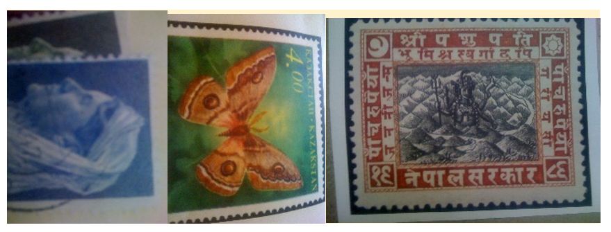

Figure 6 - Stamp_insurance3.pdf email attachment

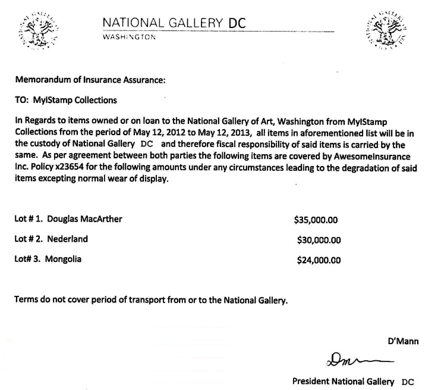

+ /vol5/mobile/Media/DCIM/100APPLE/IMG_0054.JPG
+ /vol5/mobile/Media/DCIM/100APPLE/IMG_0065.JPG
+ /vol5/mobile/Media/DCIM/100APPLE/IMG_0071.JPG

Figure 7 - The three stamps mentioned in Figure 6 above

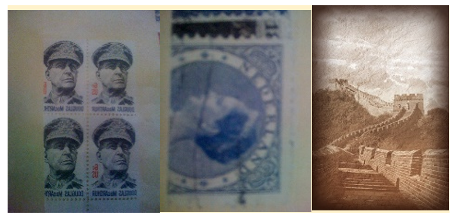

## Evidence relating to the defacement of museum art

This sub-section provides details regarding the evidence found as it relates to the defacement of museum art.

**There was no evidence related to defacement of museum art in the iphone image.** Only evidence related to the theft of stamps.

## Plot Timeline

For details please refer to Appendix A below and the section labelled ‘Evidence relating to theft of valuable stamps” above.

+	On Tue, Jun 19 2012 at 02:38 PM, Pat (perrypatsum@yahoo.com) emails Tracy (coralbluetwo@hotmail.com) with an MP3 audio recording attachment that contains synthesized voice instructions on how to install a VirtualBox VM on her computer “for later use”.
+	On Thu, Jul 5 2012 06:18:23 PM Tracy and Carry agree via SMS to meet at Bubba’s Grill
+	Fri Jul 6 2012 11:49:31 AM Pat arranges via email with subject “can’t pass up”, a “proposition” with someone who goes by “King” (throne1966@hotmail.com) and Tracy.
+	On Fri, Jul 6 2012 04:27:16 PM Tracy and Carry confirm the meeting at Bubba’s via SMS.
+	On Sat, Jul 7 2012 07:36:35 PM, Tracy receives an SMS from an unknown number that she has received a Target Gift Card worth $1000 "Congratulations, your entry in last months drawing won you a FREE $1,000 Target Giftcard! Enter ""703"" at www.target.com.trdt.biz to tell us where to ship it". Note that the URL is faked to look like it’s related to Target Corp, but is a subdomain of trdt.biz, for which no registration can be found at this time. Presumably, this payment was received from Alex, but there is no proof.
+	Mon, Jul 9 2012 10:44:11 AM Tracy sends herself an email describing which stamps to steal, and how much they are insured for.
+	On Mon, Jul 9 2012 10:44:11 AM, Pat and “King” arrange via email a list of things that King will need to do the job.
+	Tue, Jul 10 2012 11:24 AM, Pat forwards the list to Tracy.
+	On Wed, Jul 11 2012 12:41:45 PM, Carry and Tracy arrange via SMS for Tracy to deliver a tablet to Carry.
+	On Thu, Jul 12 2012 05:06:45 PM, Tracy texts Carry to ask how the flashmob is going.

Figure 8 - Persons under investigation

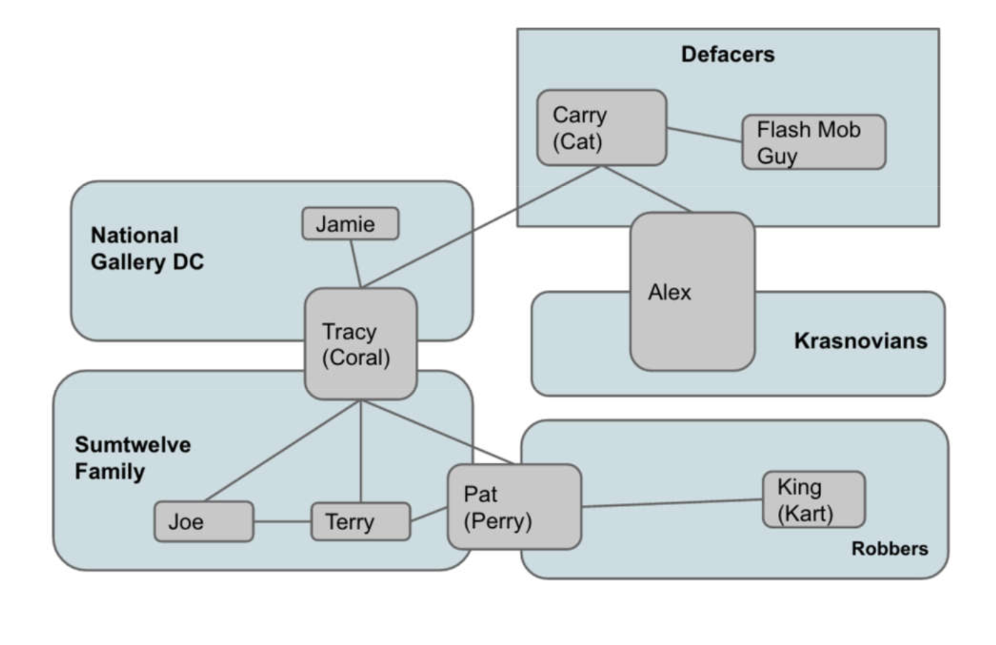

## Conclusion

Evidence found on Tracy’s iPhone indicated the following:

+	Tracy and Pat conspired with each other using email account aliases. Pat used ‘patsumtwelve@gmail.com’ and Tracy used ‘coralbluetwo@hotmail.com’. Pat’s usual email address is ‘perrypatsum@yahoo.com’, and Tracy’s normal email address is ‘tracysumtwelve@gmail.com’
+	Pat coordinated with a known criminal ‘King’ with email address ‘throne1966@hotmail.com’ to steal some valuable stamps. Pat knows King’s parole officer, so he was able to exert influence on King.
+	Tracy conspires with Carry to deliver a notebook with data pertaining to a flashmob that Carry wants to organize. This would help to distract the museum’s security guards while King commits the theft.
+	Tracy sends herself documents related to the stamps and how much they are insured for.
+	Tracy is notified that a ‘Gift Card’ for $1000 has been set up for her. This is most likely payment from either Carry via Alex, or directly from Alex. The website URL is purposely crafted to look like it is from Target, but is actually located in the trdt.biz domain. No information on that URL is available at this time.
+	There are three clusters of WiFi and Cell location info, but it’s not clear what the significance is. Further analysis would be needed to correlate the location info and timing with the email and SMS exchanges.

## Appendix A - Correspondence Evidence

This subsection will provide an amalgamation of the email and SMS corresponce evidence which was obtained from the forensic image file of the iPhone. 

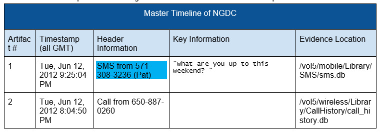

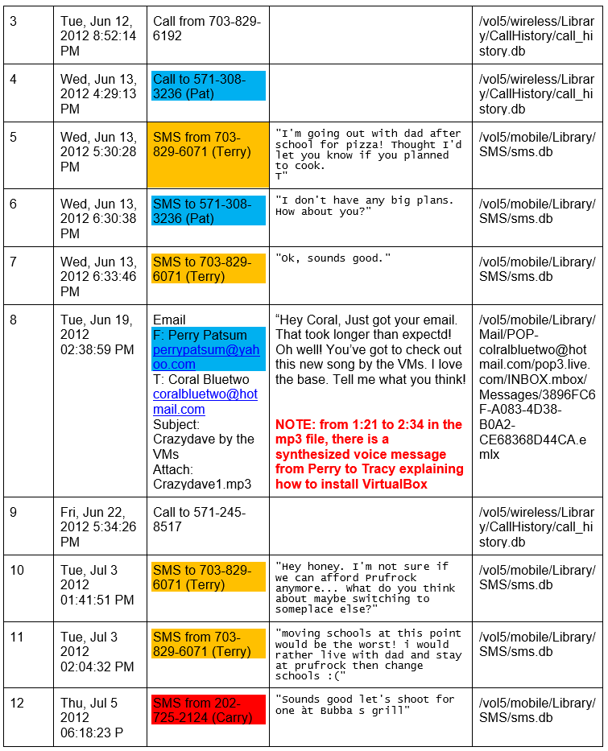

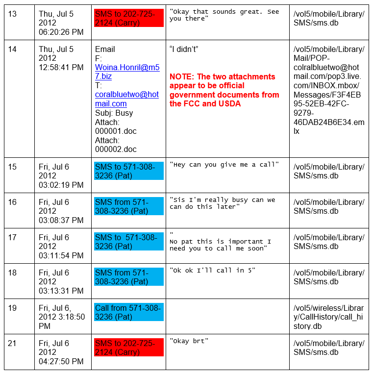

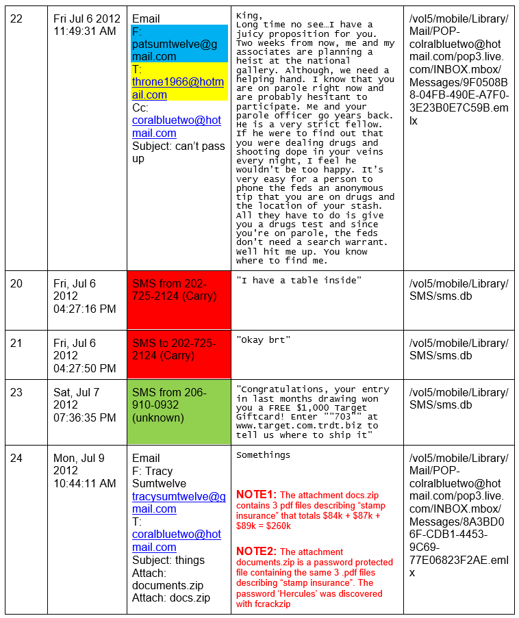

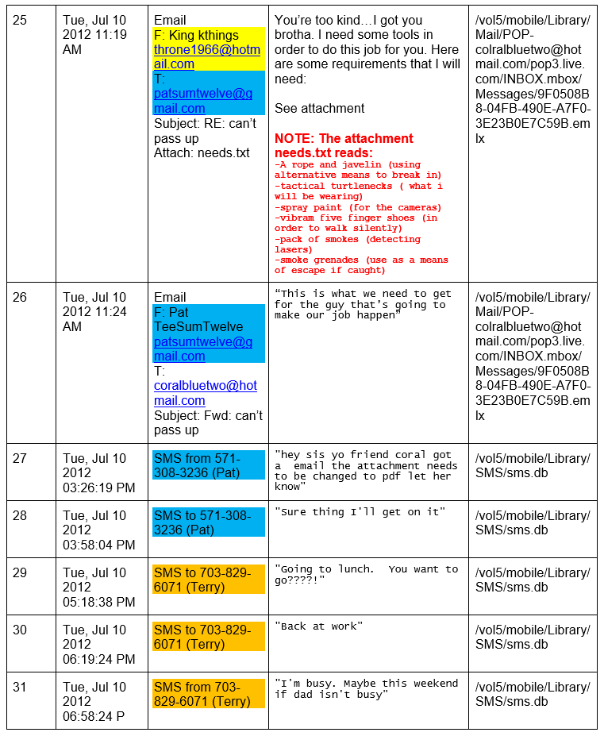

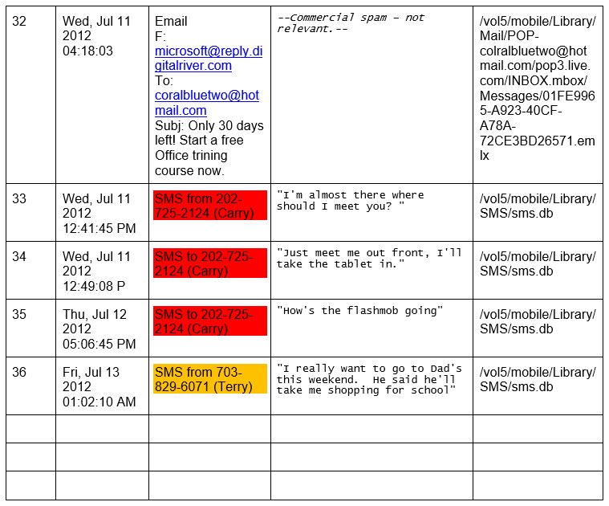


## Appendix B - WiFi and GPS Location information

WiFi locations gathered from /vol5/root/Library/Caches/locationd/consolidated.db and plotted using maps.google.com

Figure B1 - National Gallery with green marker vs. iPhone GPS Lat / Lon tracking coordinates data

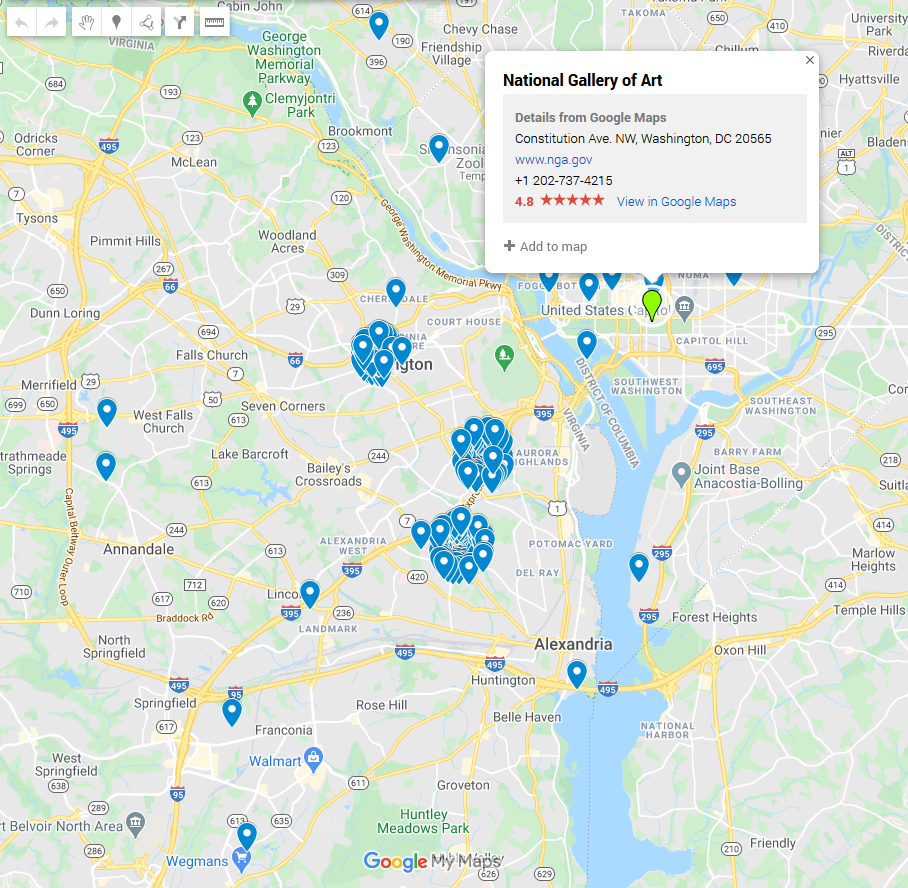
